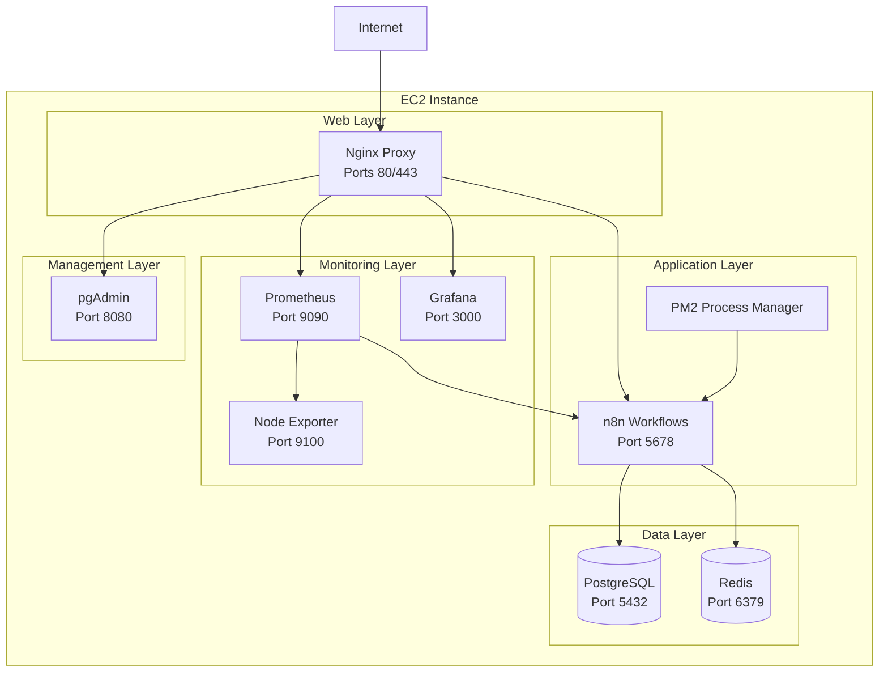

# 🚀 Production-Ready n8n Deployment on AWS EC2

[](https://www.ansible.com/)
[](https://ubuntu.com/)
[](LICENSE)

> **Deploy n8n workflow automation tool on a single AWS EC2 instance with enterprise-grade security, monitoring, and
flexibility for both development and production environments.**

## 📋 Table of Contents

- [🎯 Overview](#-overview)
- [✨ Features](#-features)
- [🏗️ Architecture](#️-architecture)
- [📋 Prerequisites](#-prerequisites)
- [⚡ Quick Start](#-quick-start)
- [🔧 Configuration](#-configuration)
- [🚀 Deployment Options](#-deployment-options)
- [📊 Monitoring & Management](#-monitoring--management)
- [🔒 Security](#-security)
- [💾 Backup & Recovery](#-backup--recovery)
- [🛠️ Maintenance](#️-maintenance)
- [📚 Documentation](#-documentation)
- [❓ Troubleshooting](#-troubleshooting)
- [🤝 Contributing](#-contributing)

## 🎯 Overview

This project provides a **complete, production-ready n8n deployment** on a single AWS EC2 instance using Ansible
automation. It supports both development (IP-based HTTP) and production (domain-based HTTPS) environments with
comprehensive monitoring, security, and backup solutions.

### 🎪 Live Demo

- **IP-based**: `http://demo-ip:5678` (Development)
- **Domain-based**: `https://n8n.demo.com` (Production)

## ✨ Features

### 🌐 **Dual Deployment Modes**

- **🔓 IP-based HTTP**: Quick setup for development/testing
- **🔒 Domain-based HTTPS**: Production-ready with SSL certificates

### 🛡️ **Enterprise Security**

- Let's Encrypt SSL certificates with auto-renewal
- UFW firewall + Fail2ban intrusion prevention
- PostgreSQL with SCRAM-SHA-256 authentication
- Redis with password protection
- Security headers and rate limiting

### 📊 **Complete Monitoring Stack**

- Prometheus metrics collection
- Grafana dashboards and alerting
- System health monitoring
- Automated health checks

### 💾 **Backup & Recovery**

- Automated daily backups
- S3 integration support
- Point-in-time recovery
- Configuration backup

### 🔧 **Easy Management**

- One-command deployment
- Automated service management
- Health monitoring scripts
- Maintenance utilities

## 🏗️ Architecture



**📖 Detailed Architecture**: See [docs/ARCHITECTURE.md](docs/ARCHITECTURE.md)

## 📋 Prerequisites

### 🖥️ **System Requirements**

| Component        | Minimum          | Recommended      |
|------------------|------------------|------------------|
| **EC2 Instance** | t3.medium        | t3.large         |
| **RAM**          | 4 GB             | 8 GB             |
| **Storage**      | 20 GB            | 50 GB            |
| **OS**           | Ubuntu 22.04 LTS | Ubuntu 22.04 LTS |

### 🔑 **Access Requirements**

- ✅ SSH access to EC2 instance
- ✅ Sudo privileges on the instance
- ✅ Domain name (optional, for HTTPS setup)
- ✅ AWS CLI configured (optional, for S3 backups)

### 💻 **Local Machine Requirements**

#### 1. **Install Ansible**

<details>
<summary><strong>🐧 Ubuntu/Debian</strong></summary>

```bash
# Update package index
sudo apt update

# Install Ansible
sudo apt install ansible -y

# Verify installation
ansible --version
```

</details>

<details>
<summary><strong>🍎 macOS</strong></summary>

```bash
# Using Homebrew
brew install ansible

# Using pip
pip3 install ansible

# Verify installation
ansible --version
```

</details>

<details>
<summary><strong>🪟 Windows</strong></summary>

```powershell
# Using WSL2 (Recommended)
wsl --install
# Then follow Ubuntu instructions

# Using pip
pip install ansible

# Verify installation
ansible --version
```

</details>

#### 2. **Install Required Collections**

```bash
# Install community collections
ansible-galaxy collection install community.general
ansible-galaxy collection install community.postgresql
ansible-galaxy collection install community.grafana
```

### 🌐 **AWS Setup**

#### 1. **Launch EC2 Instance**

```bash
# Using AWS CLI (optional)
aws ec2 run-instances \
  --image-id ami-0c02fb55956c7d316 \
  --instance-type t3.medium \
  --key-name your-key-pair \
  --security-group-ids sg-xxxxxxxxx \
  --subnet-id subnet-xxxxxxxxx \
  --tag-specifications 'ResourceType=instance,Tags=[{Key=Name,Value=n8n-server}]'
```

#### 2. **Configure Security Group**

| Type   | Protocol | Port Range | Source    | Description          |
|--------|----------|------------|-----------|----------------------|
| SSH    | TCP      | 22         | Your IP   | SSH access           |
| HTTP   | TCP      | 80         | 0.0.0.0/0 | HTTP traffic         |
| HTTPS  | TCP      | 443        | 0.0.0.0/0 | HTTPS traffic        |
| Custom | TCP      | 3000       | Your IP   | Grafana (IP mode)    |
| Custom | TCP      | 5678       | Your IP   | n8n (IP mode)        |
| Custom | TCP      | 8080       | Your IP   | pgAdmin (IP mode)    |
| Custom | TCP      | 9090       | Your IP   | Prometheus (IP mode) |

#### 3. **DNS Configuration** (Domain-based only)

Set up A records pointing to your EC2 instance:

```dns
n8n.yourdomain.com      → your-ec2-ip
grafana.yourdomain.com  → your-ec2-ip
prometheus.yourdomain.com → your-ec2-ip
pgadmin.yourdomain.com  → your-ec2-ip
```

## ⚡ Quick Start

### 🚀 **Method 1: One-Command Deployment (Recommended)**

```bash
# 1. Clone the repository
git clone https://github.com/indranandjha1993/ec2-n8n-automation.git
cd ec2-n8n-automation

# 2. Make deployment script executable
chmod +x scripts/deploy.sh

# 3. Run interactive deployment
./scripts/deploy.sh
```

The script will guide you through:

- ✅ Deployment type selection (IP vs Domain)
- ✅ Target host configuration
- ✅ Domain setup (if applicable)
- ✅ Email configuration
- ✅ SSH key selection

### 🎯 **Method 2: Direct Commands**

<details>
<summary><strong>🔓 IP-based Deployment (Development)</strong></summary>

```bash
# Quick IP-based deployment
./scripts/deploy.sh \
  --type ip \
  --host your-ec2-ip \
  --user ubuntu \
  --key ~/.ssh/your-key.pem \
  --email admin@example.com \
  --yes
```

**Access URLs:**

- n8n: `http://your-ec2-ip:5678`
- Grafana: `http://your-ec2-ip:3000`
- Prometheus: `http://your-ec2-ip:9090`
- pgAdmin: `http://your-ec2-ip:8080`

</details>

<details>
<summary><strong>🔒 Domain-based Deployment (Production)</strong></summary>

```bash
# Production domain-based deployment
./scripts/deploy.sh \
  --type domain \
  --domain yourdomain.com \
  --host your-ec2-ip \
  --user ubuntu \
  --key ~/.ssh/your-key.pem \
  --email admin@yourdomain.com \
  --yes
```

**Access URLs:**

- n8n: `https://n8n.yourdomain.com`
- Grafana: `https://grafana.yourdomain.com`
- Prometheus: `https://prometheus.yourdomain.com`
- pgAdmin: `https://pgadmin.yourdomain.com`

</details>

### 🎉 **What Happens During Deployment**

1. **🔍 Prerequisites Check**: Validates Ansible, SSH connectivity
2. **🛠️ System Setup**: Updates packages, installs dependencies
3. **🗄️ Database Setup**: Installs and configures PostgreSQL
4. **🚀 Cache Setup**: Installs and configures Redis
5. **⚙️ n8n Installation**: Installs n8n with PM2 process manager
6. **🌐 Proxy Setup**: Configures Nginx with SSL (if domain-based)
7. **📊 Monitoring Setup**: Installs Prometheus, Grafana, exporters
8. **🔒 Security Hardening**: Configures firewall, fail2ban
9. **💾 Backup Setup**: Configures automated backups
10. **✅ Health Checks**: Verifies all services are running

## 🔧 Configuration

### 📝 **Basic Configuration**

1. **Copy Example Configuration**:
   ```bash
   cp inventory/group_vars/all.yml.example inventory/group_vars/all.yml
   ```

2. **Edit Configuration**:
   ```bash
   nano inventory/group_vars/all.yml
   ```

### ⚙️ **Key Configuration Options**

<details>
<summary><strong>🌐 Deployment Settings</strong></summary>

```yaml
# Deployment type: 'ip' or 'domain'
deployment_type: "ip"

# Domain name (required for domain-based deployment)
domain_name: "yourdomain.com"

# Admin email for SSL certificates and notifications
admin_email: "admin@yourdomain.com"
```

</details>

<details>
<summary><strong>🚀 Application Settings</strong></summary>

```yaml
n8n:
  version: latest          # n8n version
  port: 5678              # Application port
  log_level: info         # Logging level
  timezone: UTC           # Application timezone
  basic_auth:
    enabled: true         # Enable basic authentication
    user: "admin"         # Username
    password: ""          # Auto-generated if empty
```

</details>

<details>
<summary><strong>🗄️ Database Settings</strong></summary>

```yaml
postgresql:
  version: 14             # PostgreSQL version
  port: 5432             # Database port
  database: n8n          # Database name
  user: n8n              # Database user
  password: ""           # Auto-generated if empty
  max_connections: 100   # Max connections
```

</details>

<details>
<summary><strong>🔒 Security Settings</strong></summary>

```yaml
security:
  ufw_enabled: true           # Enable UFW firewall
  fail2ban_enabled: true      # Enable fail2ban
  ssh_port: 22               # SSH port
  max_login_attempts: 5      # Max failed login attempts
  ban_time: 3600            # Ban duration in seconds
```

</details>

<details>
<summary><strong>📊 Monitoring Settings</strong></summary>

```yaml
monitoring:
  prometheus:
    port: 9090            # Prometheus port
    retention: 15d        # Data retention period
  grafana:
    port: 3000           # Grafana port
    admin_user: admin    # Admin username
    admin_password: ""   # Auto-generated if empty
```

</details>

**📖 Complete Configuration Reference**: See [docs/CONFIGURATION.md](docs/CONFIGURATION.md)

## 🚀 Deployment Options

### 🔄 **Manual Ansible Deployment**

<details>
<summary><strong>📋 Step-by-Step Manual Deployment</strong></summary>

1. **Configure Inventory**:
   ```bash
   # Edit inventory file
   nano inventory/hosts.yml
   ```

   ```yaml
   ---
   all:
     children:
       n8n_servers:
         hosts:
           n8n-server:
             ansible_host: "your-ec2-ip"
             ansible_user: "ubuntu"
             ansible_ssh_private_key_file: "~/.ssh/your-key.pem"
   ```

2. **Test Connectivity**:
   ```bash
   ansible all -i inventory/hosts.yml -m ping
   ```

3. **Run Deployment**:
   ```bash
   # IP-based deployment
   ansible-playbook -i inventory/hosts.yml playbooks/deploy-n8n.yml \
     -e deployment_type=ip \
     -e admin_email=admin@example.com

   # Domain-based deployment
   ansible-playbook -i inventory/hosts.yml playbooks/deploy-n8n.yml \
     -e deployment_type=domain \
     -e domain_name=yourdomain.com \
     -e admin_email=admin@yourdomain.com
   ```

</details>

### 🎛️ **Advanced Deployment Options**

<details>
<summary><strong>🔧 Custom Variables</strong></summary>

```bash
# Deploy with custom settings
ansible-playbook -i inventory/hosts.yml playbooks/deploy-n8n.yml \
  -e deployment_type=domain \
  -e domain_name=example.com \
  -e n8n_version=1.0.0 \
  -e postgresql_version=15 \
  -e backup_enabled=true \
  -e backup_s3_bucket=my-backup-bucket
```

</details>

<details>
<summary><strong>🏷️ Tag-based Deployment</strong></summary>

```bash
# Deploy only specific components
ansible-playbook -i inventory/hosts.yml playbooks/deploy-n8n.yml \
  --tags "common,postgresql,n8n"

# Skip specific components
ansible-playbook -i inventory/hosts.yml playbooks/deploy-n8n.yml \
  --skip-tags "monitoring,ssl"
```

Available tags:

- `common` - System setup and dependencies
- `postgresql` - Database installation
- `redis` - Cache installation
- `n8n` - Application installation
- `nginx` - Proxy configuration
- `ssl` - SSL certificate setup
- `monitoring` - Monitoring stack
- `security` - Security hardening

</details>

## 📊 Monitoring & Management

### 📈 **Access Monitoring Services**

| Service        | IP-based Access  | Domain-based Access             | Default Credentials   |
|----------------|------------------|---------------------------------|-----------------------|
| **n8n**        | `http://ip:5678` | `https://n8n.domain.com`        | admin / [generated]   |
| **Grafana**    | `http://ip:3000` | `https://grafana.domain.com`    | admin / [generated]   |
| **Prometheus** | `http://ip:9090` | `https://prometheus.domain.com` | admin / [generated]   |
| **pgAdmin**    | `http://ip:8080` | `https://pgadmin.domain.com`    | [email] / [generated] |

### 🔍 **Health Monitoring**

```bash
# Manual health check
sudo /usr/local/bin/n8n-health-check.sh

# View health check logs
sudo tail -f /var/log/n8n/health-check.log

# Check service status
sudo systemctl status postgresql redis-server nginx prometheus grafana-server
```

### 📊 **Grafana Dashboards**

Pre-configured dashboards include:

- **System Overview**: CPU, memory, disk, network metrics
- **n8n Performance**: Workflow executions, response times
- **Database Metrics**: PostgreSQL performance and connections
- **Redis Metrics**: Cache hit rates, memory usage

### 🚨 **Alerting**

Configure alerts in Grafana for:

- High CPU/memory usage
- Disk space warnings
- Service downtime
- Failed workflow executions

**📖 Monitoring Guide**: See [docs/MONITORING.md](docs/MONITORING.md)

## 🔒 Security

### 🛡️ **Security Features**

- **🔥 Network Security**: UFW firewall with minimal open ports
- **🚫 Intrusion Prevention**: Fail2ban with custom rules
- **🔐 SSL/TLS**: Let's Encrypt certificates with auto-renewal
- **🗄️ Database Security**: SCRAM-SHA-256 authentication
- **🔑 Access Control**: Basic authentication and strong passwords
- **📝 Security Headers**: HSTS, CSP, and other security headers

### 🔧 **Security Configuration**

<details>
<summary><strong>🔥 Firewall Rules</strong></summary>

```bash
# View current firewall status
sudo ufw status verbose

# Add custom rules
sudo ufw allow from your-ip to any port 22
sudo ufw allow 80
sudo ufw allow 443
```

</details>

<details>
<summary><strong>🚫 Fail2ban Configuration</strong></summary>

```bash
# Check fail2ban status
sudo fail2ban-client status

# View banned IPs
sudo fail2ban-client status sshd

# Unban an IP
sudo fail2ban-client set sshd unbanip x.x.x.x
```

</details>

<details>
<summary><strong>🔐 SSL Certificate Management</strong></summary>

```bash
# Check certificate status
sudo certbot certificates

# Manual renewal
sudo certbot renew

# Test renewal process
sudo certbot renew --dry-run
```

</details>

**📖 Security Guide**: See [docs/SECURITY.md](docs/SECURITY.md)

## 💾 Backup & Recovery

### 📦 **Automated Backups**

Backups run daily at 2 AM and include:

- ✅ PostgreSQL database dump
- ✅ n8n workflows and configurations
- ✅ System configurations
- ✅ Application logs

### 🔧 **Backup Management**

<details>
<summary><strong>💾 Manual Backup</strong></summary>

```bash
# Run manual backup
sudo /usr/local/bin/n8n-backup.sh

# List available backups
ls -la /opt/backups/

# Check backup logs
sudo tail -f /var/log/backup.log
```

</details>

<details>
<summary><strong>☁️ S3 Integration</strong></summary>

```bash
# Configure S3 backup (edit backup script)
sudo nano /usr/local/bin/n8n-backup.sh

# Set S3_BUCKET variable
S3_BUCKET="your-backup-bucket"

# Test S3 upload
aws s3 ls s3://your-backup-bucket/
```

</details>

<details>
<summary><strong>🔄 Restore Process</strong></summary>

```bash
# 1. Stop services
sudo systemctl stop postgresql redis-server nginx

# 2. Extract backup
sudo tar -xzf /opt/backups/n8n_backup_YYYYMMDD_HHMMSS.tar.gz -C /tmp/

# 3. Restore database
sudo -u postgres psql -d n8n < /tmp/postgresql_backup.sql

# 4. Restore n8n data
sudo tar -xzf /tmp/n8n_userdata.tar.gz -C /opt/n8n/

# 5. Restart services
sudo systemctl start postgresql redis-server nginx
```

</details>

**📖 Backup Guide**: See [docs/BACKUP.md](docs/BACKUP.md)

## 🛠️ Maintenance

### 🔄 **Service Management**

<details>
<summary><strong>🚀 n8n Management</strong></summary>

```bash
# Check n8n status
sudo -u n8n pm2 status

# Restart n8n
sudo -u n8n pm2 restart n8n

# View n8n logs
sudo -u n8n pm2 logs n8n

# Monitor n8n processes
sudo -u n8n pm2 monit
```

</details>

<details>
<summary><strong>🗄️ Database Management</strong></summary>

```bash
# Connect to database
sudo -u postgres psql -d n8n

# Check database size
sudo -u postgres psql -d n8n -c "SELECT pg_size_pretty(pg_database_size('n8n'));"

# Vacuum database
sudo -u postgres psql -d n8n -c "VACUUM ANALYZE;"
```

</details>

<details>
<summary><strong>🔄 System Updates</strong></summary>

```bash
# Update system packages
sudo apt update && sudo apt upgrade -y

# Update n8n
sudo npm update -g n8n

# Restart services after updates
sudo systemctl restart postgresql redis-server nginx
sudo -u n8n pm2 restart n8n
```

</details>

### 📊 **Performance Monitoring**

```bash
# System resources
htop
df -h
free -h

# Service logs
sudo journalctl -u postgresql -f
sudo journalctl -u redis-server -f
sudo journalctl -u nginx -f
```

**📖 Maintenance Guide**: See [docs/MAINTENANCE.md](docs/MAINTENANCE.md)

## 📚 Documentation

| Document                                        | Description                                  |
|-------------------------------------------------|----------------------------------------------|
| [📖 Architecture](docs/ARCHITECTURE.md)         | Detailed system architecture and components  |
| [🚀 Deployment Guide](docs/DEPLOYMENT_GUIDE.md) | Step-by-step deployment instructions         |
| [⚙️ Configuration](docs/CONFIGURATION.md)       | Complete configuration reference             |
| [🔒 Security Guide](docs/SECURITY.md)           | Security best practices and hardening        |
| [📊 Monitoring](docs/MONITORING.md)             | Monitoring setup and dashboard configuration |
| [💾 Backup & Recovery](docs/BACKUP.md)          | Backup strategies and recovery procedures    |
| [🛠️ Maintenance](docs/MAINTENANCE.md)          | Ongoing maintenance and troubleshooting      |
| [🔧 Troubleshooting](docs/TROUBLESHOOTING.md)   | Common issues and solutions                  |

## ❓ Troubleshooting

### 🚨 **Common Issues**

<details>
<summary><strong>🔴 n8n Won't Start</strong></summary>

```bash
# Check PM2 status
sudo -u n8n pm2 status

# Check logs
sudo -u n8n pm2 logs n8n

# Check database connection
sudo -u postgres psql -d n8n -c "SELECT 1;"

# Restart n8n
sudo -u n8n pm2 restart n8n
```

</details>

<details>
<summary><strong>🔴 SSL Certificate Issues</strong></summary>

```bash
# Check certificate status
sudo certbot certificates

# Test nginx configuration
sudo nginx -t

# Renew certificates
sudo certbot renew --force-renewal

# Restart nginx
sudo systemctl restart nginx
```

</details>

<details>
<summary><strong>🔴 Database Connection Errors</strong></summary>

```bash
# Check PostgreSQL status
sudo systemctl status postgresql

# Check connections
sudo -u postgres psql -c "SELECT * FROM pg_stat_activity;"

# Restart PostgreSQL
sudo systemctl restart postgresql
```

</details>

<details>
<summary><strong>🔴 High Resource Usage</strong></summary>

```bash
# Check system resources
htop
df -h
free -h

# Check n8n processes
sudo -u n8n pm2 monit

# Scale n8n instances
sudo -u n8n pm2 scale n8n 2
```

</details>

### 📞 **Getting Help**

1. **📋 Check Logs**: Always start by checking relevant logs
2. **🔍 Run Health Check**: Use the automated health check script
3. **📖 Review Documentation**: Check the relevant documentation section
4. **🐛 Create Issue**: If problem persists, create a GitHub issue with:
    - Deployment type (IP/domain)
    - Error messages and logs
    - System information
    - Steps to reproduce

**📖 Complete Troubleshooting Guide**: See [docs/TROUBLESHOOTING.md](docs/TROUBLESHOOTING.md)

## 🤝 Contributing

We welcome contributions! Please see our [Contributing Guide](CONTRIBUTING.md) for details.

### 🔄 **Development Setup**

```bash
# Fork and clone the repository
git clone https://github.com/indranandjha1993/ec2-n8n-automation.git
cd ec2-n8n-automation

# Create a feature branch
git checkout -b feature/your-feature-name

# Make your changes and test
./scripts/deploy.sh --type ip --host test-instance

# Submit a pull request
```

### 📝 **Reporting Issues**

Please use our [Issue Template](.github/ISSUE_TEMPLATE.md) when reporting bugs or requesting features.

---

## 📄 License

This project is licensed under the MIT License - see the [LICENSE](LICENSE) file for details.

## 🙏 Acknowledgments

- [n8n.io](https://n8n.io/) - The amazing workflow automation tool
- [Ansible](https://www.ansible.com/) - Infrastructure automation
- [Let's Encrypt](https://letsencrypt.org/) - Free SSL certificates
- [Prometheus](https://prometheus.io/) & [Grafana](https://grafana.com/) - Monitoring stack

---

<div align="center">

**⭐ If this project helped you, please give it a star! ⭐**

[🐛 Report Bug](https://github.com/indranandjha1993/ec2-n8n-automation/issues) • [✨ Request Feature](https://github.com/indranandjha1993/ec2-n8n-automation/issues) • [💬 Discussions](https://github.com/indranandjha1993/ec2-n8n-automation/discussions)

</div>
